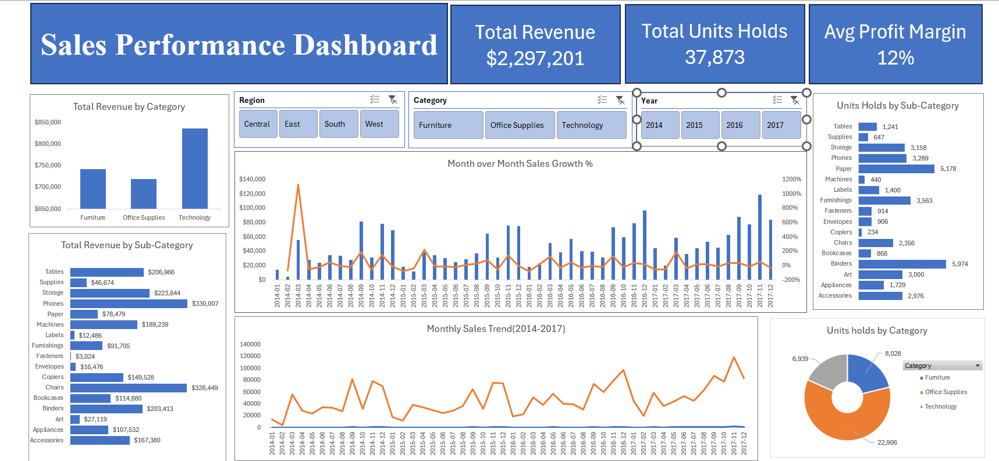

# 📊 Sales Dashboard – Task 1 (Elevvo Internship)

This project was created as part of the **Elevvo Internship Program**.  
It is an **Excel-based Interactive Sales Dashboard** developed using the Superstore dataset to analyze sales performance.

## Features
- Monthly & Yearly Sales Trend Analysis  
- **MoM** (Month-over-Month) % change calculation  
- **YoY** (Year-over-Year) % change calculation  
- Interactive **Slicers** for Region, Year, and Category filtering  
- Visualizations for **Regional** and **Category-wise** sales performance  

## Files Included
| File Name | Description |
|-----------|-------------|
| `Sales_Dashboard_Task1.xlsx` | Main Excel dashboard |
| `Superstore.csv` | Dataset used for creating the dashboard |
| `Excel_Sales_Dashboard_ss.png` | Screenshot preview of the dashboard |

## Tools Used
- **Microsoft Excel** (Pivot Tables, Charts, Slicers, Calculated Fields)  
- **Dataset**: Sample Superstore from kaggle 
---
## 📷 Dashboard Preview

## How to Use
1. Download the `Sales_Dashboard_Task1.xlsx` file  
2. Open in Microsoft Excel  
3. Use slicers to filter by **Region**, **Year**, or **Category**  
4. Explore the charts for insights  

## Internship Info
This task is part of the **Elevvo Internship** submission requirements for Data Analytics.  

